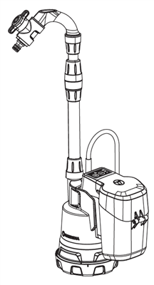
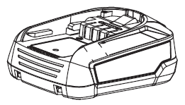
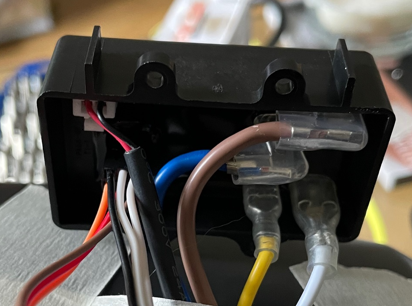
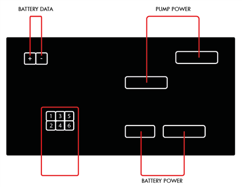
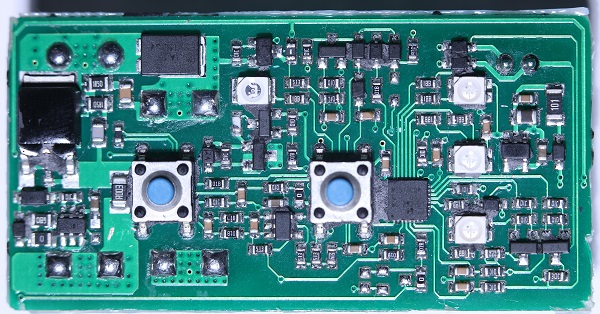
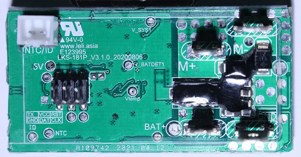
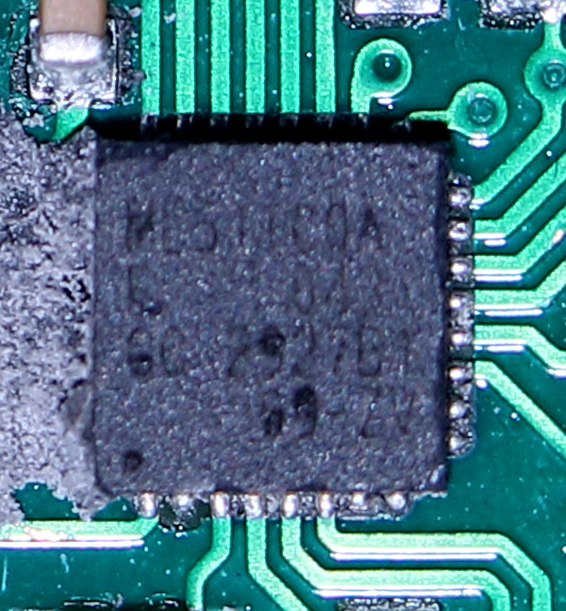
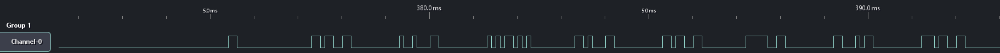
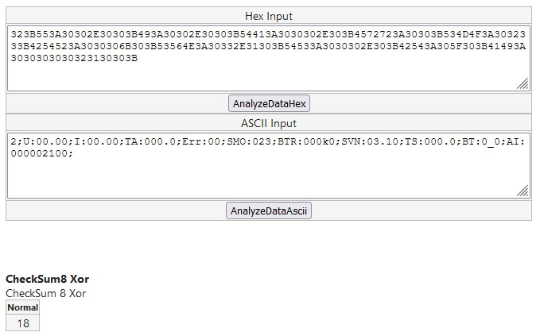

# GardenaBWP
I have a garden and would like to water it automatically with rain. For this I bought a «Gardena Battery Rain Water Tank Pump 2000/2» and would like to control via an ESP microcontroller.

**Gardena Battery Rain Water Tank Pump 2000/2 18V P4A** - Article No. 14602
- Website: https://www.gardena.com/int/products/lawn-care/grass-trimmers/system-battery-p4a-pba-18v-45/970508501/
- Manuel: https://www.gardena.com/tdrdownload//pub000081324/doc000149307 or [Datasheet](Documentation/doc000149307.pdf)

**Gardena System Battery P4A PBA 18V/45** - Article No. 14903-20
- Website: https://www.gardena.com/int/products/watering/pump/battery-rain-water-tank-pump-2000-2-li-18-ready-to-use-set/970511001/
- Manuel: https://www.gardena.com/tdrdownload//pub000081354/doc000149497 or [Datasheet](Documentation/doc000149497.pdf)

## Reverse Engineering

### Akku

| Description | Pin |
| --- | --- |
| Plus (+) | 1 |
| NTC | 2 |
| ID | 3 |
| Minus (-) | 4 |

### Control Panel
After opening the control panel, I found that the board is molded in black plastic.

Label Description:
HW: 3.1.4A3 | SW: 3.1.0 | 20210819

#### PCB
I removed the plastic from the board.

- www.leli.asia
- E123995
- LKS-181P_V3.1.0_20200806
- A109742 2021 04 12

#### MCU
Nuvoton NuMicro ML51TC0AE

- https://www.nuvoton.com/products/microcontrollers/8bit-8051-mcus/low-power-ml51-series/ml51tc0ae/
- https://www.nuvoton.com/export/resource-files/DS_ML51_ML54_ML56_Series_EN_Rev2.02.pdf or [Datasheet](Documentation/DS_ML51_ML54_ML56_Series_EN_Rev2.02.pdf)

#### 6-Pin Header
Nuvoton NU-Link + TX

| Description | Pin | Pin | Description |
| --- | --- | --- | --- |
| TX | 1 | 2 | GND |
| VCC | 3 | 4 | DAT |
| RST | 5 | 6 | CLK |

- https://www.nuvoton.com/export/resource-files/UM_Nuvoton_Nu-Link_Debug_Adapter_EN_Rev1.01.pdf

#### Logic Analyzer: TX

Baudrate: 9600 8N1

#### Recived Data: TX

**RAW**
FE323B553A30302E30303B493A30302E30303B54413A3030302E303B4572723A30303B534D4F3A3032333B4254523A3030306B303B53564E3A30332E31303B54533A3030302E303B42543A305F303B41493A3030303030323130303B18FD
FE323B553A32302E34313B493A30302E30303B54413A3032352E343B4572723A30303B534D4F3A3032333B4254523A3034376B353B53564E3A30332E31303B54533A3032352E373B42543A335F313B41493A3030303030323130313B19FD
FE323B553A32302E34303B493A30302E30303B54413A3032352E343B4572723A30303B534D4F3A3032333B4254523A3034376B353B53564E3A30332E31303B54533A3032352E383B42543A335F313B41493A3030303034313130323B13FD
FE323B553A32302E34303B493A30302E30303B54413A3032352E343B4572723A30303B534D4F3A3032333B4254523A3034376B353B53564E3A30332E31303B54533A3032352E383B42543A335F313B41493A3030303034313130333B12FD

**HEX and ASCII**
| First Byte | ? | Batt. V | Batt. A | Batt. Temp | Error | SMO | Batt. Type. Rev | Software Ver. | Temp | Batt. Type | Auto Incremental | Checksum | Last Byte |
| --- | --- | --- | --- | --- | --- | --- | --- | --- | --- | --- | --- | --- | --- | 
| FB |  | U | I | TA | Err | SMO | BTR | SVN | TS | BT | AI | CS | LB |
| 0xFE | 2 | 00.00 | 00.00 | 000.0 | 00 | 023 | 000k0 | 03.10 | 000.0 | 0_0 | 000002100 | 0x18 | 0xFD |
| 0xFE | 2 | 20.41 | 00.00 | 025.4 | 00 | 023 | 047k5 | 03.10 | 025.7 | 3_1 | 000002101 | 0x19 | 0xFD |
| 0xFE | 2 | 20.40 | 00.00 | 025.4 | 00 | 023 | 047k5 | 03.10 | 025.8 | 3_1 | 000041102 | 0x13 | 0xFD |
| 0xFE | 2 | 20.40 | 00.00 | 025.4 | 00 | 023 | 047k5 | 03.10 | 025.8 | 3_1 | 000041103 | 0x12 | 0xFD |

**Checksume:** To create the checksum, start reading after the first byte, end before the checksum byte and calculate the checksum using the CheckSum8 Xor algorithm.

**HEX and ASCII without BATTERY DATA CABLE**
| FB |  | U | I | TA | Err | SMO | BTR | SVN | TS | BT | AI | CS | LB |
| --- | --- | --- | --- | --- | --- | --- | --- | --- | --- | --- | --- | --- | --- | 
| 0xFE | 2 | 00.00 | 00.00 | 000.0 | 00 | 023 | 000k0 | 03.10 | 000.0 | 0_0 | 000002100 | 0x18 | 0xFD |
| 0xFE | 2 | 20.46 | 00.00 | -20.0 | 00 | 023 | 999k9 | 03.10 | 024.6 | 0_0 | 000002101 | - | 0xFD |
| 0xFE | 2 | 20.46 | 00.00 | -20.0 | 07 | 023 | 999k9 | 03.10 | 024.6 | 0_0 | 000031102 | - | 0xFD |

**HEX and ASCII without BATTERY DATA CABLE AND PUMP**
| FB |  | U | I | TA | Err | SMO | BTR | SVN | TS | BT | AI | CS | LB |
| --- | --- | --- | --- | --- | --- | --- | --- | --- | --- | --- | --- | --- | --- | 
| 0xFE | 2 | 00.00 | 00.00 | 000.0 | 00 | 023 | 000k0 | 03.10 | 000.0 | 0_0 | 000041000 | 0x1E | 0xFD |
| 0xFE | 2 | 20.46 | 00.00 | -20.0 | 00 | 023 | 999k9 | 03.10 | 026.1 | 0_0 | 000041001 | - | 0x02 |

**HEX and ASCII without PUMP**
| FB |  | U | I | TA | Err | SMO | BTR | SVN | TS | BT | AI | CS | LB |
| --- | --- | --- | --- | --- | --- | --- | --- | --- | --- | --- | --- | --- | --- | 
| 0xFE | 2 | 00.00 | 00.00 | 000.0 | 00 | 023 | 000k0 | 03.10 | 000.0 | 0_0 | 000001000 | 0x1A | 0xFD |
| 0xFE | 2 | 20.39 | 00.00 | 025.4 | 00 | 023 | 047k5 | 03.10 | 025.7 | 3_1 | 000041001 | 0x11 | 0xFD |
| 0xFE | 2 | 20.39 | 00.00 | 025.4 | 00 | 023 | 047k5 | 03.10 | 025.8 | 3_1 | 000041002 | 0x12 | 0xFD |
| 0xFE | 2 | 20.39 | 00.00 | 025.4 | 00 | 023 | 047k5 | 03.10 | 025.8 | 3_1 | 000041003 | 0x13 | 0xFD |

**HEX and ASCII without PUMP und Power Up**
| FB |  | U | I | TA | Err | SMO | BTR | SVN | TS | BT | AI | CS | LB |
| --- | --- | --- | --- | --- | --- | --- | --- | --- | --- | --- | --- | --- | --- | 
| 0xFE | 2 | 00.00 | 00.00 | 000.0 | 00 | 023 | 000k0 | 03.10 | 000.0 | 0_0 | 000002100 | 0x18 | 0xFD |
| 0xFE | 2 | 20.40 | 00.00 | 025.3 | 00 | 023 | 047k5 | 03.10 | 025.7 | 3_1 | 000002101 | 0x11 | 0xFD |
| 0xFE | 2 | 20.39 | 00.00 | 025.4 | 00 | 023 | 047k5 | 03.10 | 025.8 | 3_1 | 000002102 | 0x1F | 0xFD |
| 0xFE | 2 | 20.39 | 00.00 | 025.4 | 08 | 023 | 047k5 | 03.10 | 025.8 | 3_1 | 000032103 | 0x15 | 0xFD |
| 0xFE | 2 | 20.39 | 00.00 | 025.4 | 08 | 023 | 047k5 | 03.10 | 025.8 | 3_1 | 000032103 | 0x15 | 0xFD |

# Notes
**Gardena**
- https://gitlab.com/nbrgmn/wall-e-esp8266-automower/-/tree/develop
- https://www.roboter-forum.com/index.php?thread/12310-wlan-anbindung-gardena-r40li-hausautomatisierung-fernbedienung-etc/&pageNo=2
- https://www.youtube.com/watch?v=DqCoxzLTGXg&t=567s

**Arduino Logic Analyzer**
- https://github.com/gillham/logic_analyzer
- https://github.com/jawi/ols

**Arduino Baudrate Finder**
- https://github.com/Sjord/autobaud

**Checksum Calculator**
- https://www.scadacore.com/tools/programming-calculators/online-checksum-calculator/

**Battery Hack Sheet**
- https://docs.google.com/spreadsheets/d/1y2jpoUwTOCbt6W3V7BTANON0qFRX7MPgF3T8NVuv8oo/edit#gid=698376076
