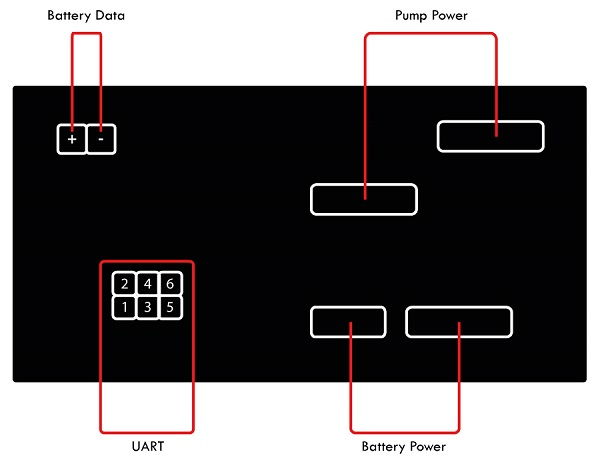

# GardenaBWP
Gardena Battery Rain Water Tank Pump 2000/2 18V P4A - Art. 14602
## Documents
Manuel: https://www.gardena.com/tdrdownload//pub000081324/doc000149307

## Hardware
### Akku
18V, 2.5A POWER FOR ALL ALLIANCE

| Description | Pin |
| --- | --- |
| Plus (+) | 1 |
| Data? | 2 |
| Data? | 3 |
| Minus (-) | 4 |

### Control Panel

Label:
- HW: 3.1.4A3
- SW: 3.1.0
- 20210819

#### UART-Port
| Description | Pin | Pin | Description |
| --- | --- | --- | --- |
| GND | 1 | 2 | TX |
| - | 3 | 4 | - |
| - | 5 | 6 | - |

#### Logic Analyzer

Baudrate: 9600

#### Revived Data
| First Byte | ? | Batt. V | Batt. A | Batt. Temp | Error | SMO | Batt. Type. Rev | Software Ver. | Temp | Batt. Type | Auto Incremental | Checksum | Last Byte |
| --- | --- | --- | --- | --- | --- | --- | --- | --- | --- | --- | --- | --- | --- | 
| FB | ? | U | I | TA | Err | SMO | BTR | SVN | TS | BT | AI | CS | LB |
| 0xFE | 2 | 20.46 | 4.08 | 25.4 | 0 | 23 | 047k5 | 3.1 | 24.8 | 3_1 | 2100 | 3B | FD |

# Notes
## Gardena
- https://gitlab.com/nbrgmn/wall-e-esp8266-automower/-/tree/develop
- https://www.roboter-forum.com/index.php?thread/12310-wlan-anbindung-gardena-r40li-hausautomatisierung-fernbedienung-etc/&pageNo=2
- https://www.youtube.com/watch?v=DqCoxzLTGXg&t=567s

## Arduino Logic Analyzer
- https://github.com/gillham/logic_analyzer
- https://github.com/jawi/ols

## Arduino Baudrate Finder
- https://github.com/Sjord/autobaud
